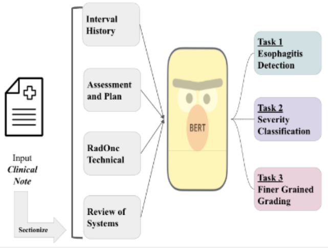

# Deep Learning-Based Natural Language Processing to Automate Esophagitis Severity Grading from the Electronic Health Records

1. To the best of our knowledge, this is the first effort to automatically extract toxicity severity according to CTCAE guidelines from clinic notes, providing proof-of-concept for NLP to support detailed toxicity reporting.
2. Our models hold quite promising results on both notes and patients level predictions.
3. Our model also shows good results on both in and out-of-domain evaluations where in-domain as lung cancer cohort and out-of-domain testing on seprate esophageal cancer patients cohorts.

# Objective/Purpose:

Radiotherapy (RT) toxicities can impair survival and quality-of-life, yet their risk factors and optimal management are under-studied. Real-world evidence holds enormous potential to improve our understanding of RT adverse events, but this information is often only documented in clinic notes and cannot, at present, be automatically extracted. To address this unmet need, we developed natural language processing (NLP) algorithms to automatically identify the presence and severity of esophagitis from notes of patients treated with thoracic RT.

# Materials/Methods:

Our corpus consisted of:

A gold-labeled dataset of 1524 clinic notes from 124 lung cancer patients treated with RT (in-domain), manually annotated for CTCAE v5.0 esophagitis grade.
A silver-labeled dataset of 2420 notes from 1832 patients on whom toxicity grades had been collected as structured data during clinical care.
We developed a fine-tuning pipeline for pre-trained BERT-based neural models for three tasks:

1. Classifying the presence of esophagitis
2. Classifying grade 0-1 vs. >= 2 esophagitis
3. Classifying grade 0 vs. 1 vs. 2-3

A note sectionizer was used to let the model focus on the most informative sections. Independent validation in a separate clinical cohort of esophageal cancer patients was selected for out-of-domain transferability testing. This cohort consists of a manually annotated dataset of 345 notes from 75 esophageal cancer patients treated with RT. We also report patient-level results by evaluating the maximum predicted grade per patient.

# Results:

Fine-tuning PubmedBERT yielded the best-performing models. Performance is shown in the table. Selecting the most informative note sections (primarily Interval History, Assessment & Plan) during fine-tuning improved macro-F1 by >=2% for all tasks. Including silver-labeled data improved the macro-F1 by >= 3% across all tasks.

And you can find our detailed performance tables here:
https://docs.google.com/spreadsheets/d/1kR2qDXBNn-ojvqoyNZGHgHkjLL49PsP6/edit?usp=sharing&ouid=101275375270014554042&rtpof=true&sd=true

# Code structure:

The structure of this repo is quite self-explanatory. The main training file is train.py, and all configurations are handled by hydra under the config folder. You can find the baseline for TF-IDF weighted BoW+SGD in the Jupyter notebook under the Baselines folder, and all utility functions are located under the src folder:

    `n_metrics.py` handles all metric reporting.
    `n_trainer_classes.py` contains all customized trainers.
    `n_proc.py` holds all preprocessing functions.
    
And under folder `sectionizer`

    `sys_run_demo.ipynb` is the sample run to show how to use the sectionizer.
    `sectionize_docs.py` holds the sectionizer function.
    `section_patterns.json` contains the sectionizer rules.

# Citation:
Waiting for arxiv link
